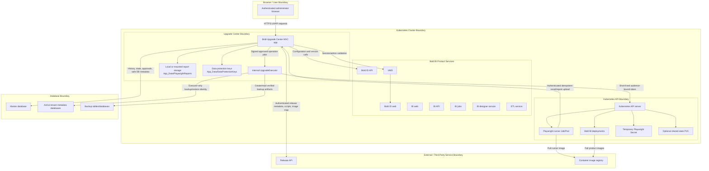
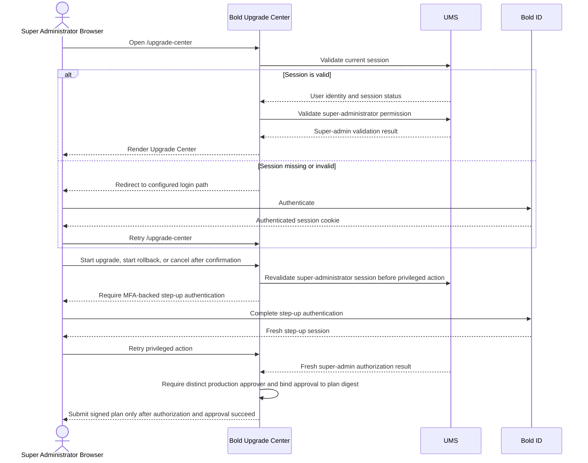
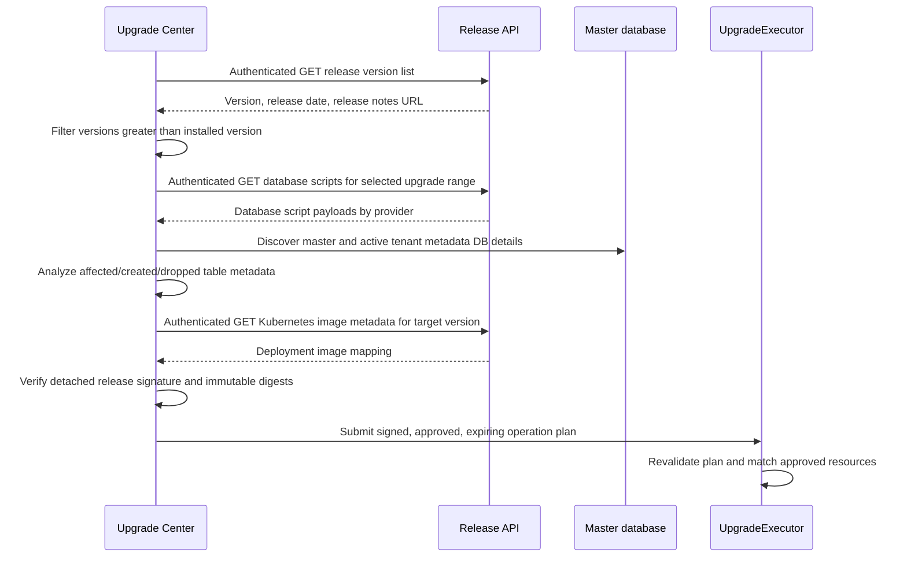
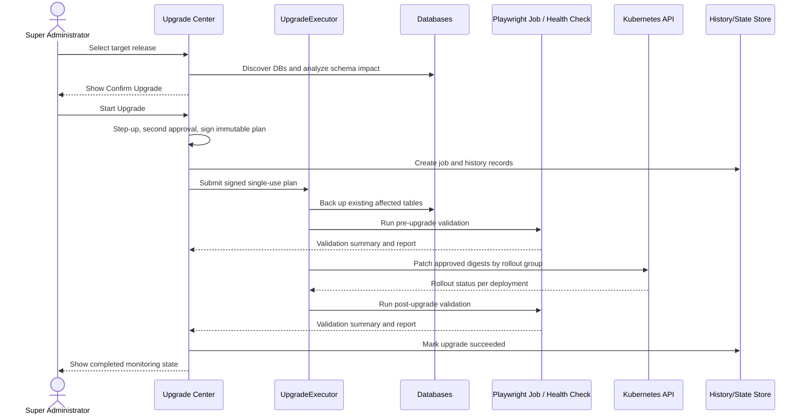
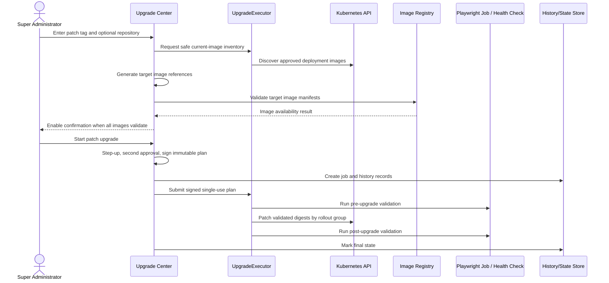
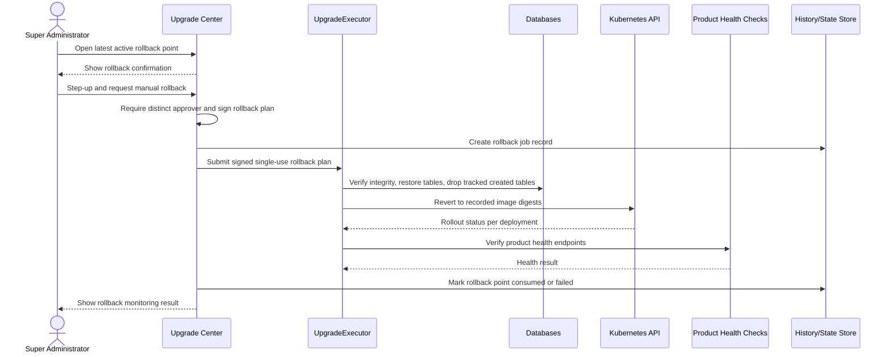
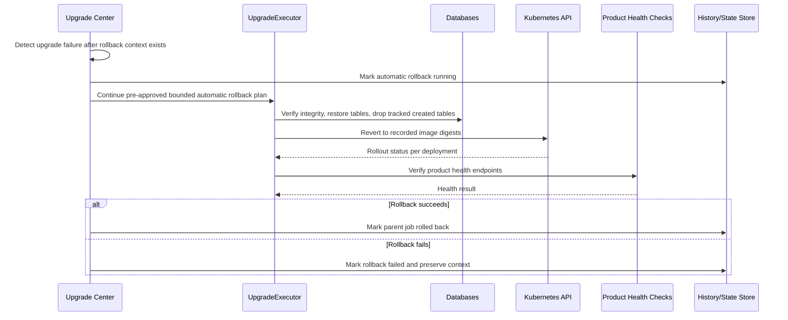
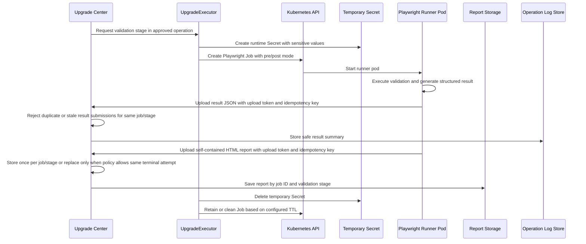
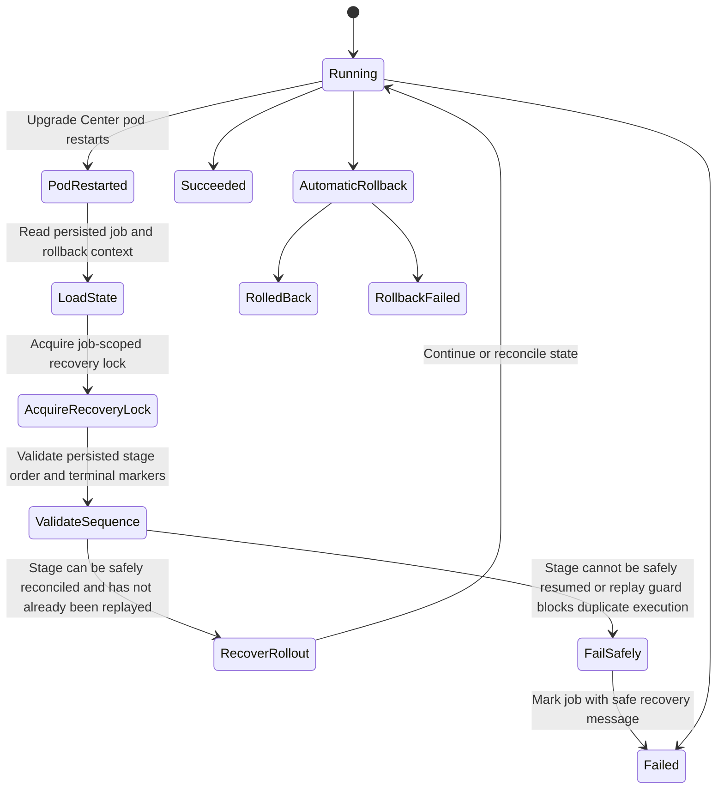

# Bold Upgrade Center Architecture Design

## Authoritative Security Classification

This document describes the **approved secured target architecture**, not an uncontrolled implementation. The following conditions are architectural prerequisites and are included when calculating residual design risk:

- `/upgrade-center` is private administrative functionality and has no direct public-internet route.
- Only authenticated super administrators from the approved private access path can open the UI.
- The MVC application has no Kubernetes mutation, Secret-management, database-backup, or database-restore credential.
- The internal executor accepts only signed, approved, expiring, single-use operation plans and has no browser-accessible endpoint.
- Production operations require MFA-backed step-up and a different requester and approver.
- Only the current Bold BI namespace and an explicit deployment allowlist can be modified.
- Database scope is limited to affected tables in Bold BI master and tenant metadata databases. Customer dashboards and customer business data are excluded.
- Backup artifacts cannot be listed, viewed, or downloaded through the UI or any public API.
- Release scripts and images require independently signed metadata and immutable digests.
- Missing identity, approval, signature, digest, lock, audit, backup-integrity, or policy validation causes a fail-closed result before mutation.

Any deployment that does not enforce these prerequisites is **non-conformant with this architecture** and must not be released. That non-conformant scenario is not the residual-risk case assessed by this document.

### Residual Design Risk Score

The secured target architecture is assessed using a 0–100 factor scale and weighted residual-risk calculation:

| Residual factor | Weight | Score after mandatory controls | Weighted contribution |
| --- | ---: | ---: | ---: |
| Data sensitivity | 25% | 30 | 7.50 |
| External exposure | 20% | 10 | 2.00 |
| Exploit likelihood | 20% | 15 | 3.00 |
| Attack-path feasibility | 15% | 15 | 2.25 |
| Unmitigated control gaps | 10% | 10 | 1.00 |
| Bounded business impact | 10% | 70 | 7.00 |
| **Total residual design risk** | **100%** |  | **22.75 / 100** |

**Rounded residual score: 23 / 100 — LOW**

The score is below 30 because there is no anonymous/public administration path, the web tier possesses no mutation authority, privileged execution requires two independently authenticated people and a signed one-time plan, database scope excludes customer business data, and technical blast radius is constrained to approved resources in one namespace. Security verification remains a release-quality activity; it does not change which controls form the approved target architecture.

## System Context

Bold Upgrade Center is an ASP.NET Core MVC application deployed as a Kubernetes service in the same namespace as the Bold BI workloads it manages. It integrates with Bold ID/UMS for authentication, the release/version API for upgrade metadata, Bold BI master and tenant **metadata** databases for backup/history/state, and Kubernetes APIs for image rollout, validation jobs, rollback, and cleanup. Customer dashboard/business data is outside the Upgrade Center backup and restore scope.

The production security architecture separates the privately reachable, user-facing MVC application from privileged execution. The MVC application validates users, prepares immutable operation plans, collects approvals, and displays state. A dedicated in-cluster `UpgradeExecutor` performs only approved metadata-database and namespace-scoped Kubernetes mutations. The web application never receives deployment-patch, Secret-management, database-backup, or database-restore credentials.

## High-Level Architecture

```text
Browser
  |
  v
Bold Upgrade Center MVC app
  |
  +-- Bold ID / UMS authentication and admin validation
  +-- Release API version, script, and image metadata
  +-- History, state, audit, and approval data
  +-- Signed immutable operation request
        |
        v
      In-cluster UpgradeExecutor
        +-- Metadata database backup/restore
        +-- Kubernetes API
        |
        +-- Bold BI deployments
        +-- Playwright validation Jobs
        +-- Temporary Secrets
        +-- Optional shared state PVC
```

## Main Application Layers

- Controllers: route UI and API requests, enforce authorization, expose monitoring, report upload, and report viewing endpoints.
- Services: implement upgrade orchestration, Kubernetes operations, database backup/restore, version retrieval, Playwright job execution, product health checks, history, rollback, and operation logs.
- Models and ViewModels: represent UI state, job stages, history entries, confirmation views, rollback views, and operation progress.
- Views and static assets: render the MVC UI under `/upgrade-center`.
- Security: validates the UMS session and super-administrator status before allowing access or privileged actions. Every state-changing endpoint independently enforces authorization and anti-forgery validation.

## Important Services

- `UpgradeWorkflowService`: starts upgrades, rollbacks, cancellation, and history records.
- `UpgradeApprovalService`: records production approver decisions and enforces separation of duties.
- `UpgradeOperationPlanService`: creates a canonical immutable operation plan containing the source/target versions, database scope, script digests, image digests, expiry, nonce, and requested action.
- `UpgradeExecutor`: an internal-only privileged component that validates the approved signed operation plan and executes the narrowly scoped database/Kubernetes mutation. It has no public ingress and does not render UI.
- `UpgradeJobRunner`: orchestrates the background standard release/custom patch upgrade workflow.
- `UpgradeRollbackJobRunner`: orchestrates manual rollback.
- `KubernetesUpgradeService`: discovers deployments, patches images, monitors rollouts, rolls back images, and reconciles interrupted rollouts.
- `UpgradeDatabaseBackupService`: discovers databases, analyzes impact, creates backups, restores backups, and cleans backup artifacts.
- `UpgradeDatabaseScriptImpactService`: retrieves and parses database scripts for affected table analysis.
- `PlaywrightScriptRunner`: delegates to Kubernetes Playwright jobs or product health checks depending on configuration.
- `PlaywrightKubernetesJobService`: creates temporary Secrets, Jobs, optional shared PVCs, monitors Playwright execution, and cleans temporary resources.
- `ProductHealthCheckService`: verifies product health endpoints when Playwright jobs are disabled and during rollback health verification.
- `DatabaseUpgradeHistoryStore`: stores operation history in the master database.
- `DatabaseUpgradeOperationalStateStore`: stores recoverable job and rollback context.
- `DatabaseUpgradeOperationLogStore`: stores job-level operation logs.
- `PlaywrightReportStore`: stores uploaded HTML reports by job ID and validation stage.

## Runtime Workflow

### Standard Release Upgrade

```text
Admin selects target version
  -> Confirmation flow resolves database impact
  -> Admin confirms
  -> Background job starts
  -> Schema Backup
  -> Pre-Upgrade Validation
  -> Kubernetes Upgrade
  -> Post-Upgrade Validation
  -> Complete or automatic rollback
```

The HTTP request that starts the job does not remain open for the full operation. The UI polls job status and log endpoints.

### Custom Patch Upgrade

```text
Admin enters patch tag and optional repository
  -> Current deployment images are discovered
  -> Target custom images are generated
  -> Image references are validated
  -> Admin confirms
  -> Background job starts
  -> Database backup is skipped
  -> Validation and Kubernetes patch workflow runs
```

### Rollback

```text
Rollback point selected
  -> Admin confirms
  -> Restore backed-up database tables
  -> Revert Kubernetes images
  -> Wait for rollout
  -> Run product health checks
  -> Mark rollback point consumed
```

## Data Persistence

The application persists:

- Upgrade history.
- Operational job state.
- Rollback context.
- Database backup mappings.
- Kubernetes previous and target image mappings.
- Operation logs.

The application does not persist plain-text credentials, full connection strings, private keys, tokens, or authentication cookies.

HTML reports are stored outside the web root in the configured report storage path, normally under `App_Data/PlaywrightReports`. Report storage and Data Protection key storage use separate mounts and access policies. In production, Data Protection keys must be persistent and encrypted; they must not remain only on an ephemeral container filesystem.

## Database Design Responsibilities

The Upgrade Center uses the master database for application history and operational state. Database provider services support PostgreSQL, MySQL, Microsoft SQL Server, and Oracle for backup and restore work.

Backup behavior:

- Create backups only for existing affected tables.
- Skip missing affected tables with warnings.
- Track created tables separately where impact metadata allows.
- Restore backed-up tables during rollback.
- Clean old or consumed rollback backups according to rollback lifecycle.

## Kubernetes Design

The Upgrade Center runs with namespace-scoped RBAC. Required operations include:

- Read and patch deployments.
- Create, read, watch, and delete Playwright Jobs.
- Read pods and pod logs.
- Create and delete temporary Secrets.
- Create and delete shared state PVCs when enabled.

Bold BI expected deployments:

- `id-web-deployment`
- `id-api-deployment`
- `id-ums-deployment`
- `bi-web-deployment`
- `bi-api-deployment`
- `bi-jobs-deployment`
- `bi-dataservice-deployment`
- `bold-ai-deployment`
- `bold-etl-deployment`

`bold-ai-deployment` and `bold-etl-deployment` are optional in the default discovery list.

## Playwright Runner Design

Playwright validation runs in a separate Kubernetes Job image.

The Upgrade Center:

1. Resolves runtime configuration.
2. Creates a temporary Secret for sensitive values.
3. Creates a validation Job with the configured runner image, workers, resources, timeout, and mode.
4. Mounts shared state when enabled.
5. Monitors the Job until terminal state.
6. Receives result summary and HTML report through authenticated upload endpoints.
7. Deletes temporary sensitive resources.

The validation stage summary is based on structured result data. The HTML report is for detailed customer review and is not parsed as the source of truth.

## Health Check Design

Product health checks are used:

- As validation fallback when Playwright Kubernetes jobs are disabled.
- In rollback Verify deployment health after Kubernetes rollout succeeds.

Bold BI health targets include IDP web/API, UMS, BI web/API/jobs/designer, and ETL service endpoints resolved from configured product URLs.

## Security Design

- Access is restricted to authenticated **super administrators**. UI visibility is not an authorization control; every controller and service entry point must independently validate the current session and super-administrator permission.
- All state-changing browser requests use POST or another appropriate non-GET method and require ASP.NET Core anti-forgery validation. This includes upgrade, rollback, restore, cancellation, retry, report deletion, and Kubernetes mutation actions.
- Start Upgrade, cancel-after-mutation, manual rollback, and database restore require mandatory step-up authentication immediately before execution. If the identity provider cannot complete step-up authentication, the operation is denied; there is no fallback to an older session.
- Production upgrade, manual rollback, and restore require two distinct super-administrator identities: one requester and one approver. A user cannot approve their own operation. Approval is bound to the immutable operation digest and expires after 15 minutes; any plan change invalidates approval. Emergency break-glass use requires a separate controlled identity, incident/ticket reference, security notification, and post-event review.
- Only one upgrade, rollback, recovery, or other mutating operation may run in a namespace at a time. A database-backed distributed lock, unique active-operation constraint, and idempotency key prevent duplicate execution across replicas and restarts.
- Kubernetes RBAC is namespace-scoped and uses explicit resources, resource names where practical, and verbs. Wildcards are prohibited. The user-facing MVC ServiceAccount has no permission to patch deployments, create Secrets/Jobs/PVCs, read pod logs, or access ServiceAccount tokens; only the internal `UpgradeExecutor` and isolated Playwright identities receive their required permissions.
- Secrets are stored in encrypted Kubernetes Secrets or an approved external secret manager and passed through environment variables or mounted files inside the Playwright Job. Temporary credentials have a defined TTL and are deleted after success, failure, cancellation, timeout, and recovery.
- Sensitive values are not placed in command arguments, labels, annotations, logs, history, exception responses, report URLs, or environment dumps.
- Reports are served by authenticated and authorized Upgrade Center endpoints. HTML reports are treated as untrusted active content and rendered from a separate origin or in a sandboxed response with scripts, forms, navigation, and same-origin access disabled.
- Logs are sanitized before display or persistence. Security-relevant events are written to a durable audit trail.
- All external identifiers, including versions, image repositories, image tags, digests, namespaces, deployment names, database names, schemas, table names, paths, and job IDs, are allowlisted or strictly validated before use. They must never be concatenated into shell commands or dynamic SQL.
- Browser responses enforce secure cookies, HSTS, a restrictive Content Security Policy, frame-ancestor protection, MIME sniffing protection, safe referrer policy, output encoding, and validated redirect destinations. CORS is disabled unless an explicitly approved origin requires it.

## Privileged Execution Isolation

- `UpgradeExecutor` is exposed only through an internal ClusterIP or authenticated workload endpoint protected by default-deny NetworkPolicy. Ingress is accepted only from the Upgrade Center identity; browser, ingress-controller, Playwright, and unrelated namespace traffic is denied.
- The Upgrade Center submits a canonical operation plan signed with an approved asymmetric workload key. The executor validates issuer, audience, signature, nonce, expiry, environment, namespace, requester, approver, operation type, target resources, script digests, and image digests before mutation.
- Every operation request is single-use. The executor stores the nonce and operation digest before execution and rejects replay, expiry, approval mismatch, environment mismatch, or resource expansion.
- Executor authorization is allowlist-based. It cannot accept arbitrary Kubernetes manifests, shell commands, SQL, URLs, namespaces, deployment names, images, database targets, or filesystem paths from the browser.
- Production Kubernetes access uses short-lived projected ServiceAccount tokens with a defined audience and rotation; legacy long-lived token Secrets are prohibited. Tokens are mounted only in the executor and validation pods that require them.
- Database backup and restore use a dedicated executor-only credential. Where the provider supports it, short-lived managed identity or dynamic database credentials are required. Static credentials must be rotated, separately scoped, and inaccessible to the MVC and Playwright containers.
- The executor writes an append-only decision and execution audit record independently of the MVC application. The web application cannot alter or delete executor audit events.

## Recovery Design

The application stores job and rollback context so it can recover or reconcile safe stages after pod restart. Some stages cannot be resumed automatically if continuing could corrupt backup or rollback state; those stages must fail safely and preserve recovery information.

Playwright temporary resources are cleaned during normal completion and best-effort recovery. Rollback context is preserved when rollback fails.

Recovery acquires the same namespace-scoped distributed operation lock used by normal execution. Persisted checkpoints record operation ID, stage, attempt, previous and target image digests, backup identifiers, completion markers, and the last safe action. Backup, restore, deployment patching, rollback, and cleanup use replay guards so a restarted replica cannot repeat a non-idempotent action. If the state is inconsistent or ownership cannot be established, the service stops mutation, records an audit event, preserves recovery artifacts, and requires an authorized operator decision.

## Deployment Design

- The application is built as a standalone ASP.NET Core container.
- The service is exposed through `/upgrade-center`.
- Data Protection keys are stored under `App_Data/DataProtectionKeys` on a dedicated persistent encrypted mount or approved external key store with access restricted to the Upgrade Center identity.
- Playwright reports are stored under `App_Data/PlaywrightReports`.
- The web container does not need Node.js, Chromium, or Playwright browser dependencies.
- The Upgrade Center and Playwright containers run as non-root, disallow privilege escalation, use a read-only root filesystem where supported, drop all Linux capabilities, apply the runtime-default seccomp profile, and define CPU, memory, ephemeral-storage, and execution-time limits.
- Privileged containers, host networking, host PID/IPC, hostPath volumes, and unrestricted ServiceAccount token mounting are prohibited.
- In production, `/upgrade-center` is a private administrative interface reachable only through the approved corporate VPN/private network and identity-aware access proxy with device and MFA policy. Direct internet exposure, public Service/pod exposure, anonymous ingress, and external-ingress exceptions are prohibited.
- Default-deny Kubernetes NetworkPolicies restrict ingress and egress. The application may reach only UMS/IDP, the Release API, Kubernetes API, approved registries, health endpoints, required databases, DNS, and configured report/backup stores. The Playwright Job may reach only the tested product endpoints, required databases, DNS, registry, and its authenticated upload endpoint.

## Data Protection, Encryption, and Key Management

- TLS 1.2 or later is required for browser, Release API, registry, internal service, database, report-store, and backup-store connections where the platform supports TLS. Certificates and hostnames must be validated; insecure fallback and trust-all certificate handlers are prohibited.
- Database TLS settings are provider-specific and mandatory in production for PostgreSQL, MySQL, Microsoft SQL Server, and Oracle. Dedicated least-privileged accounts are used for discovery, backup, restore, history, and state operations.
- Master database records, operational state, reports, audit logs, backup artifacts, Kubernetes Secret data at rest, and ASP.NET Core Data Protection keys must be encrypted using platform or storage encryption.
- Data Protection keys must be persisted across replicas and restarts, protected with an approved KMS/Key Vault/HSM-backed mechanism or an approved encrypted key store, and readable only by the Upgrade Center identity. They must not be stored only on an ephemeral container filesystem in production.
- Encryption keys and service credentials have named owners, rotation procedures, access-review intervals, revocation procedures, and separation from encrypted data.
- Backup artifacts include integrity metadata, are access-controlled separately from the application database, and are verified before restoration. Backup and restore operations are audited.

## Release, Script, and Image Supply-Chain Integrity

- Release metadata and database scripts must be retrieved over authenticated TLS from the approved Release API.
- Release manifests include immutable identifiers and SHA-256 or stronger digests for database scripts and container images. The Upgrade Center rejects missing, malformed, mismatched, expired, or downgraded metadata.
- Database scripts are accepted only for the selected source/target version range and supported provider. Their digest or signature is verified before impact analysis and again before execution by the product upgrade process.
- Deployment images are pinned and recorded by immutable digest. Mutable tags may be displayed, but rollout and rollback records must retain the resolved digest.
- Production images require approved vulnerability scanning, signature verification, and provenance/attestation validation at CI and admission time. Admission policy rejects untrusted, unsigned, privileged, or policy-violating workloads.
- Release metadata uses detached digital signatures rooted in an offline or independently protected release-signing key. The Release API transport identity and the release-signing identity are separate, so compromise of the API or registry alone cannot authorize a release. At least two release-authorized identities approve production signing.
- The executor enforces an anti-rollback rule: a target version lower than the current version is accepted only for an approved rollback operation bound to the recorded rollback point.

## Kubernetes Least-Privilege Matrix

| Resource | Allowed verbs | Restrictions |
| --- | --- | --- |
| Deployments | `get`, `list`, `watch`, `patch` | Current namespace; approved Bold BI deployment names and image fields only |
| Jobs | `create`, `get`, `list`, `watch`, `delete` | Managed Playwright jobs carrying the Upgrade Center ownership label |
| Pods | `get`, `list`, `watch` | Pods owned by managed Playwright jobs or approved product deployments |
| Pods/log | `get` | Managed Playwright job pods only |
| Secrets | `create`, `get`, `delete` | Per-job temporary secret names; `list`, `watch`, and update of unrelated secrets prohibited |
| PVCs | `create`, `get`, `delete` | Only when shared validation state is enabled; managed names and size limits |

The ServiceAccount must not create or modify Roles, RoleBindings, ClusterRoles, ServiceAccounts, admission objects, nodes, namespaces, arbitrary pods, or persistent volumes. `pods/exec`, `pods/attach`, impersonation, token creation, and wildcard access are prohibited. The MVC application, UpgradeExecutor, and Playwright runner use three separate ServiceAccounts. Automated policy tests and `kubectl auth can-i` negative tests verify the MVC and Playwright identities cannot patch deployments, restore databases, read unrelated Secrets, or invoke the executor as another identity. Permissions are reviewed before each release and quarterly.

## Backup and Database Security

- Only metadata databases and explicitly identified affected tables are in scope; tenant business data is not copied unless the verified release impact requires it and the product owner has approved the scope.
- Connection strings are obtained from approved configuration/secret sources and are never returned to the browser or persisted in logs.
- Database identifiers are validated against discovered provider metadata and quoted using provider APIs. Values use parameterized commands; shell-based database command construction is prohibited.
- Backup names are generated by the service, include an operation identifier, and cannot contain user-provided path or SQL fragments.
- Backup retention, report retention, audit retention, and deletion schedules are configurable and documented. Expired artifacts are securely deleted by an authenticated cleanup process, while active rollback artifacts are protected from deletion.
- Restore validates ownership, provider, source database, operation ID, integrity metadata, and rollback state before making changes. A restore cannot target a different database discovered after confirmation without a new confirmation.

## Report Upload and Viewing Security

- Upload tokens are cryptographically random, scoped to one job, stage, artifact type, and attempt, expire after a short configured period, and become unusable after successful upload or job termination.
- Upload endpoints enforce authentication, constant-time token validation, job/stage state, content type, extension, maximum compressed and expanded size, rate limits, idempotency, and single-write rules.
- Filenames and storage paths are generated by the server. User-supplied filenames and path components are ignored, preventing path traversal and overwrite of another job's artifact.
- Structured JSON is schema-validated. HTML reports are stored outside the web root and are never trusted as the source of stage status.
- Report viewing requires current super-administrator authorization and emits an audit event. Responses use attachment download or isolated sandbox rendering with a restrictive CSP. Active content cannot access Upgrade Center cookies or APIs.
- Report deletion follows retention policy and cannot remove evidence associated with an active or unresolved operation.

## Audit Logging, Monitoring, and Incident Detection

Audit events include authentication/authorization failures; upgrade, rollback, cancellation, retry, recovery, backup, restore, report access, secret lifecycle, RBAC denial, metadata-integrity failure, image validation, and configuration changes. Each event records the actor ID, operation ID, correlation ID, source address where available, target namespace and version, action, result, timestamp, and safe failure reason without credentials or sensitive connection data.

Audit logs are centralized or exported to the approved monitoring/SIEM platform, protected from modification by application users, retained according to organizational policy, and time-synchronized. Alerts cover repeated authorization failures, concurrent-operation attempts, integrity/signature failures, unexpected image changes, rollback failure, backup/restore failure, temporary-secret cleanup failure, abnormal report uploads, and recovery requiring manual intervention.

The following detections are mandatory in production:

| Detection | Trigger | Response |
| --- | --- | --- |
| Rollback anomaly | More than one rollback request in 24 hours, rollback outside a change window, or requester/approver pattern anomaly | Block pending security review and notify product operations/security |
| Upgrade-cycle abuse | Repeated upgrade/cancel/rollback attempts for the same environment or version | Rate-limit, preserve evidence, and require a new approval |
| Image drift | Running digest differs from the approved operation plan or admission record | Stop subsequent rollout groups and initiate incident response |
| Signature/provenance failure | Release metadata, script, or image verification fails | Fail closed before mutation and page security operations |
| Secret lifecycle failure | Temporary Secret or token remains after its TTL/terminal state | Revoke/delete, alert, and block reuse |
| Report anomaly | Oversized, repeated, wrong-stage, wrong-type, or post-terminal upload | Reject, record source/job, and alert on repetition |
| Recovery inconsistency | Checkpoint sequence, lock owner, digest, or database identity does not match | Freeze mutation and require approved manual recovery |

Requester and approver receive an out-of-band notification when a production upgrade, cancellation after mutation, rollback, restore, approval expiry, or break-glass operation is requested and when it reaches a terminal state.

## Availability and Abuse Protection

- Rate limits apply to login-return processing, status polling, logs, report upload/view, confirmation, start, cancel, retry, and rollback endpoints.
- Request-body, report, JSON, log, history, and database-query limits prevent unbounded storage or memory use.
- Playwright jobs define active deadlines, retry limits, TTL cleanup, worker/resource limits, and controlled log volume.
- External calls use bounded timeouts, cancellation tokens, limited retries with backoff and jitter, and circuit-breaking where appropriate. Mutating database and Kubernetes operations are never blindly retried.
- Dependency failure before mutation stops the operation safely. Failure after mutation uses persisted checkpoints to reconcile or roll back without duplicate execution.

## Security Control Status and Approval Gates

This document defines the mandatory target design; it does not claim that a control is implemented merely because it is documented. Production deployment is blocked until every `P0` and `P1` control below has verified evidence. `Planned` or `Evidence pending` controls receive no residual-risk reduction.

| ID | Priority | Mandatory control | Required validation evidence | Release gate |
| --- | --- | --- | --- | --- |
| SEC-01 | P0 | Mandatory MFA-backed step-up for start, cancel-after-mutation, rollback, and restore | Identity integration test showing stale/non-step-up sessions are denied | Before development exit |
| SEC-02 | P0 | Requester/approver separation for production | Positive/negative workflow tests; immutable approval digest and expiry evidence | Before production |
| SEC-03 | P0 | MVC/Executor/Playwright identity isolation | RBAC manifests and automated positive/negative authorization tests | Before development exit |
| SEC-04 | P0 | Signed, expiring, single-use operation plan | Signature, replay, expiry, audience, namespace, resource-expansion, and approver-mismatch tests | Before development exit |
| SEC-05 | P0 | Independent signed release metadata and immutable image/script digests | Signing-key trust policy, verification tests, provenance and admission evidence | Before production |
| SEC-06 | P0 | Encrypted backup plus integrity verification before restore | KMS/storage configuration, tamper test, restore verification, and access test | Before production |
| SEC-07 | P0 | Persistent encrypted Data Protection key store | Key-store/KMS configuration, restart/failover test, rotation and access-denial evidence | Before production |
| SEC-08 | P1 | Private administrative ingress with VPN and identity-aware proxy; no public exception | Ingress, DNS/LB, firewall/identity-proxy, and external non-reachability test | Before production |
| SEC-09 | P1 | Default-deny ingress/egress segmentation | NetworkPolicy manifests and allowed/denied connectivity tests | Before production |
| SEC-10 | P1 | Centralized immutable audit trail and required alerts | SIEM ingestion, retention/immutability settings, alert simulation evidence | Before production |
| SEC-11 | P1 | One-time upload token and isolated HTML report rendering | Replay, size, path traversal, content-type, CSP/sandbox, and authorization tests | Before release |
| SEC-12 | P1 | Short-lived workload/database credentials and lifecycle monitoring | Token TTL/audience tests, secret cleanup alert, rotation evidence | Before production |
| SEC-13 | P1 | Rate limits and privileged-operation abuse detection | Load/abuse tests for polling, uploads, upgrade, cancel, and rollback | Before release |
| SEC-14 | P1 | Recovery replay protection and manual freeze path | Repeated-restart, checkpoint-tamper, duplicate-execution, and recovery-alert tests | Before release |

These controls are mandatory architectural invariants. The control owner records validation evidence in the security review package, and a failed control blocks the applicable release gate. The residual design score assumes the conformant architecture defined in this document; an implementation that fails a control is rejected rather than rescored as an approved deployment.

## Residual Attack-Path Treatment

The secured design reduces likelihood and attack-path feasibility as follows:

| Reported attack path | Enforced architectural treatment | Residual likelihood |
| --- | --- | --- |
| Stolen super-admin session | Private access path, mandatory MFA-backed step-up, distinct approver, expiring plan-bound approval, and out-of-band notification | Low |
| Web application compromise to Kubernetes control | Unprivileged MVC identity, isolated internal executor, signed single-use plan, resource allowlist, short-lived executor token, and admission policy | Low |
| Backup/report data exfiltration | Metadata-only scope, executor-only DB credential, encryption, separate access policies, isolated report rendering, retention, and immutable access audit | Low |
| Repeated upgrade/rollback abuse | Distributed single-operation lock, two-person approval, change-window/anomaly detection, rate limits, and security notification | Low |
| Release API or registry compromise | Independent offline-rooted release signature, immutable digests, provenance, two-person release signing, and admission verification | Low |

Together these controls produce the authoritative **residual design score of 23/100 (LOW)** stated at the beginning of this document. A failed or removed prerequisite makes the deployment non-conformant and blocks release; it is not an accepted higher-risk operating mode.

## Product Differences

This document describes Bold BI. Bold Reports uses the same architecture and service responsibilities, but product-specific release metadata, deployment list, health endpoints, Playwright runner image, worker count, resource defaults, report paths, and branding differ.

## Security Review Diagrams

### Component and Trust-Zone Architecture



### Authentication and Authorization Flow



### Release API Interaction Flow



### Standard Release Upgrade Flow



### Custom Patch Upgrade Flow



### Manual Rollback Flow



### Automatic Rollback Flow



### Playwright Report Upload Flow



### Operational State Recovery Flow



## Explicit Trust Boundaries

| Boundary | Contents | Trust Position | Primary Controls |
| --- | --- | --- | --- |
| Browser/User boundary | Super-administrator browser and session cookies | Untrusted client; all privileged actions must be revalidated server-side | Private admin access, UMS session validation, mandatory MFA-backed step-up, distinct production approver, anti-forgery and server-side checks |
| Upgrade Center boundary | Unprivileged MVC app, approval/orchestration services, report endpoints, local report storage | Semi-trusted application boundary with no direct mutation authority | Authenticated endpoints, signed operation plans, safe logging, no privileged credentials, controlled path handling |
| Privileged executor boundary | Internal-only UpgradeExecutor and its dedicated identities | Restricted mutation boundary isolated from browser and ingress | Signed single-use plans, resource allowlists, short-lived credentials, independent audit, default-deny network policy |
| Kubernetes cluster boundary | Product deployments, Playwright Jobs, Secrets, PVCs, Kubernetes API | Trusted infrastructure boundary controlled by customer/operator | Separate namespace-scoped RBAC identities, short-lived audience-bound tokens, least-privilege resource verbs, admission policy |
| Database boundary | Master and active tenant metadata DBs, backup artifacts, history/state/log tables | Sensitive product-metadata boundary; customer dashboard/business data is out of scope | Executor-only provider credentials, encryption, no credential logging, backup lifecycle, integrity-checked restore |
| Outbound dependency boundary | Release API and container registries; neither can initiate inbound connections | Authenticated outbound-only dependency | TLS, service authentication, independently signed release metadata, immutable digest/provenance verification, fail-closed retrieval |
| Product identity boundary | Bold ID/UMS services | Internal product identity dependency but separate authorization boundary | Session validation, admin validation, login redirect, continuation limited to pod memory |

## Trust Classification of Dependencies

- Bold ID and UMS are treated as trusted internal product identity services when deployed as part of the Bold BI environment. They remain a separate trust boundary because they make authentication and authorization decisions.
- Release API is an outbound-only dependency and cannot initiate a connection to the Upgrade Center. Production service authentication and TLS certificate validation are mandatory. Independently signed release metadata is mandatory, and retrieval or verification failure stops the operation before backup or image changes.
- Container registries are outbound/pull dependencies and cannot call the Upgrade Center. Signature, digest, provenance, and admission verification prevent registry compromise alone from authorizing a rollout.
- Customer databases are trusted data stores but contain sensitive tenant and operational data. The Upgrade Center must minimize exposure and avoid logging secrets or full connection strings.

## Multi-Tenant Isolation

The Upgrade Center does not implement application-level tenant isolation for end users. It is a super-administrator-only operational tool.

Tenant separation is handled at the database-discovery and database-operation level:

- Tenant database entries are read from the product master database.
- Only active tenants' metadata databases are processed; dashboard and customer business-data stores are excluded.
- Duplicate connection strings are deduplicated.
- Backup and restore operations are applied per discovered database.

The Upgrade Center UI and APIs are not intended to expose tenant-scoped self-service access.

## External Callbacks and Webhooks

The Upgrade Center does not rely on third-party webhooks.

Known callback-style flows:

- Playwright runner pod uploads structured validation results to the authenticated Upgrade Center result endpoint.
- Playwright runner pod uploads the self-contained HTML report to the authenticated Upgrade Center report endpoint.
- Upload endpoints must enforce job ID, stage, upload token, payload-size limits, and idempotency so duplicate runner submissions cannot create conflicting stage results or overwrite reports unexpectedly.

The Release API does not call back into the Upgrade Center. Image registries do not call back into the Upgrade Center. The browser polls Upgrade Center monitoring endpoints for status updates.

## Required Architecture Security Controls

| Finding | Required Control | Validation Evidence |
| --- | --- | --- |
| Privileged operations require stronger identity assurance | Start Upgrade, Start Rollback, restore, and cancellation after mutation require mandatory MFA-backed step-up authentication. Production also requires a distinct approver bound to the immutable plan digest. | Tests proving stale/non-step-up sessions, self-approval, expired approval, and changed plans are denied. |
| Release API and registry compromise could poison the supply chain | Production calls require service-to-service authentication and certificate validation. Release manifests require an independently protected detached signature, and scripts/images require immutable digests and provenance verification. | Authentication configuration, signature/digest negative tests, signing-key trust policy, admission verification, and fail-closed integration evidence. |
| Playwright callback upload flow lacks idempotency protection | Result and report upload endpoints must validate upload token, job ID, stage, and idempotency key. Duplicate submissions for the same job/stage must be ignored or handled deterministically according to a single-write policy. | API tests for duplicate result/report uploads; operation log showing one accepted terminal result per job/stage. |
| Recovery path lacks ordering or replay guards | Recovery must acquire a job-scoped lock, read persisted stage sequence, detect terminal stages, and prevent re-executing non-idempotent backup, restore, or image-patching work. Unsafe stages must fail safely with preserved context. | Recovery tests for repeated pod restarts; persisted state evidence showing no duplicate rollback or backup execution. |
